

# Talk: Digital Interoperability in the NHS

_A talk I presented in May 2026 to the [NHS DPSP](https://www.digital-prevention-services.nhs.uk/) team._

<figure>

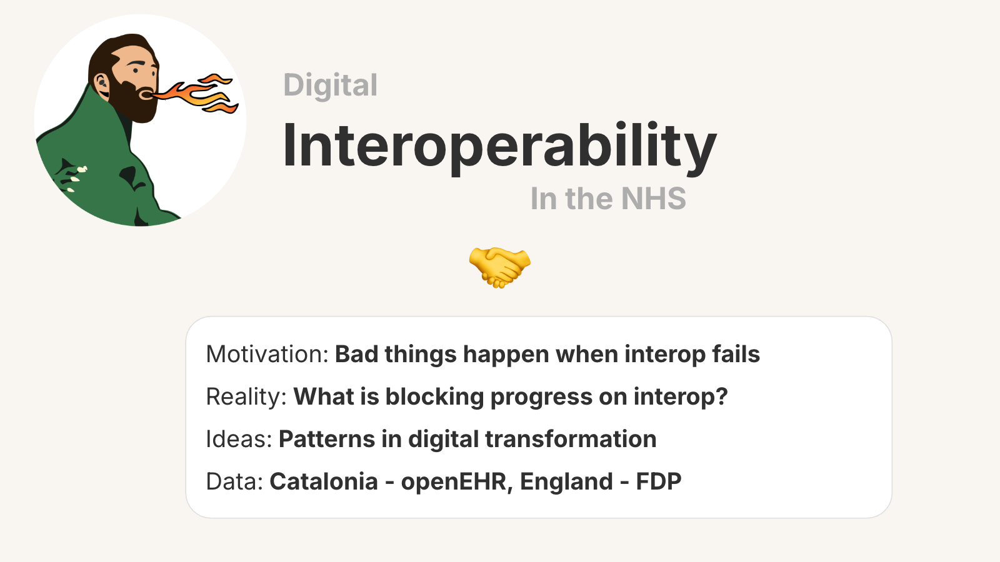

<figcaption>

I’m going to talk about digital interop in the NHS, starting with my motivation:
- the bad things that happen when it fails
- The realities of what is holding up progress
- Some ideas from academia on patterns of nation scale digital transformation.
- And then look at work that is happening here and in Catalonia.

</figcaption>
</figure>
<figure>

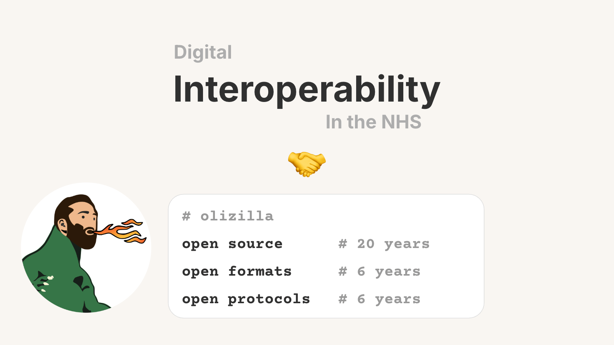

<figcaption>

To declare my biases up front
I believe open source code, open data formats and open digital protocols are the essential ingredients for interoperability.
My credentials:
- I’ve been and open source software engineer for 20 years.
- I’ve spent 6 years working on open data formats and protocols to bring the magic of content addressing to the web.
And for the last 2 years I’ve been studying a Masters of Public Administration focusing on collaboration, governance, economics and public value.
…and it’s where I built the Digital Public Infrastructure map with the team at UCL IIPP

</figcaption>
</figure>
<figure>

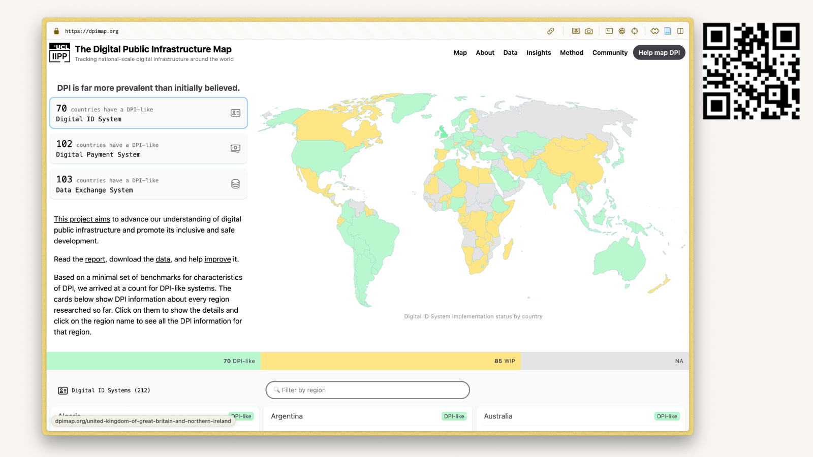

<figcaption>

Its live at [dpimap.org](https://dpimap.org)
It lets you view info about the spread of nationally owned digital infra for ID systems, payment rails, and data exchanges around the world.

The data is available in open formats like CSV, JSON
The code is open source…

</figcaption>
</figure>
<figure>

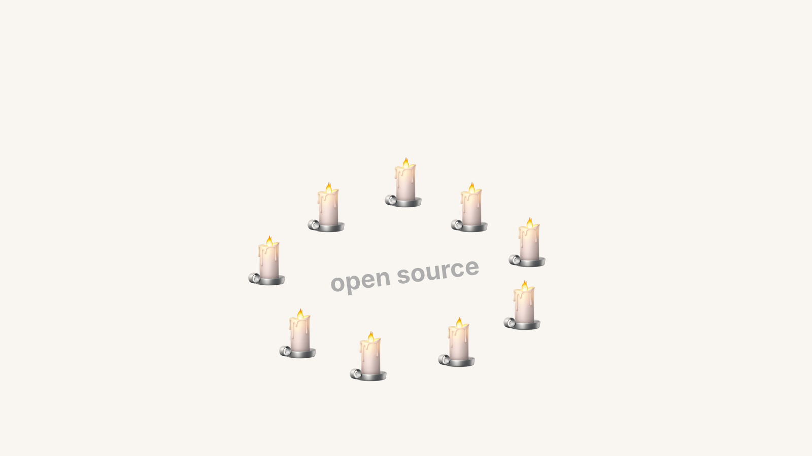

<figcaption>

I also want to take a moment to acknowledge that it feels like a rough time work in open source, with new supply chain attacks and the scrutiny and noise of AI models.

It is understandable to want to hide from it, but all the arguments against security through obscurity still stand.
And we really need to be collecting and sharing the fixes for these vulnerabilities in the public domain.

NHS DPSP Team: I see your good open source work, and I support it.

</figcaption>
</figure>
<figure>

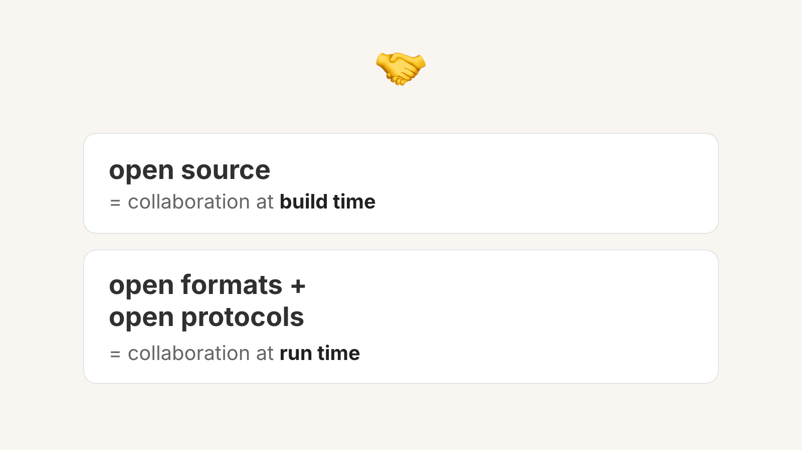

<figcaption>

In the meantime we can still make progress on interop!
Open source lets us collaborate at **build** **time**,
reusing work, and sharing solutions to common problems

Open data formats and open protocols let diverse systems collaborate at **run** **time**

Using open formats let us
- store data outside of apps
- save our work so we can open it again without paying a tithe to a proprietary vendor.

Using Open protocols let us
- define the rules of a multiplayer system, in a way that can
- shape the market for public and private vendors to collaborate,
- protect it from lock-in and
- support a healthy digital ecosystem 
- ...where vendors can demonstrate their tool by plugging it in to a well defined interface and show that it works, rather than promising it will once the procurement marathon is done.

</figcaption>
</figure>
<figure>

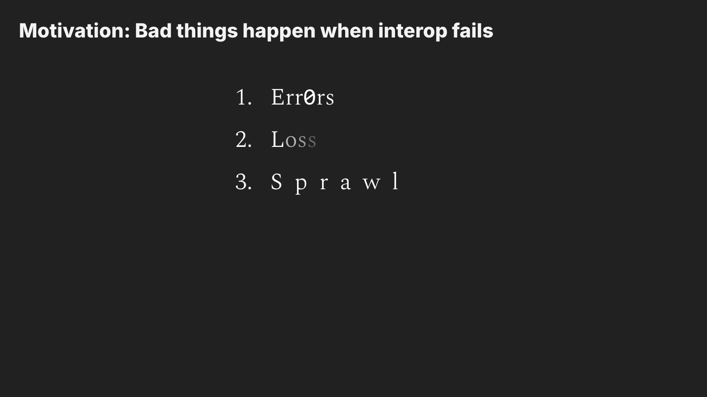

<figcaption>

So to the motivation:
why am i trying to fit any of the complexity of the NHS digital universe into my head.
Bad things happen when interop fails:
1. There are process errors that harm patients and staff
2. Data loss and degradation of our health records
3. And Digital sprawl that wastes our time and money

</figcaption>
</figure>
<figure>

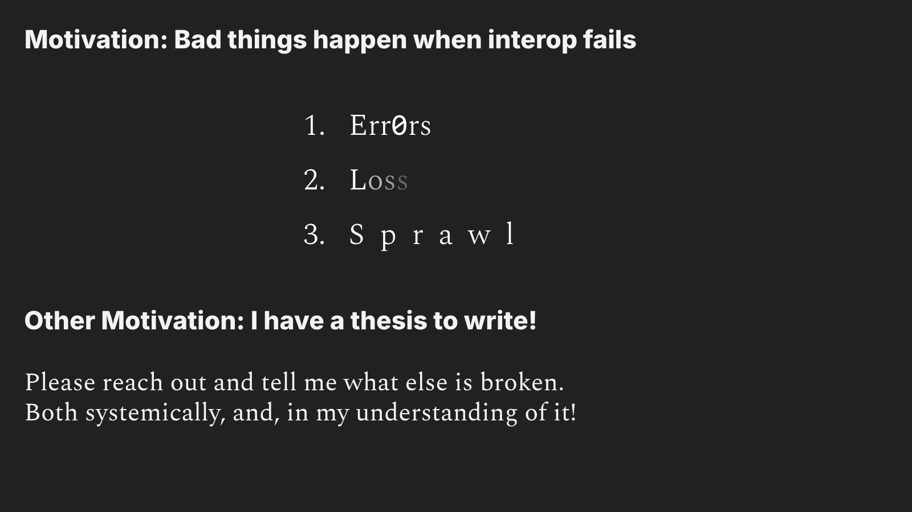

<figcaption>

My other motivation is I have a thesis to write!
Please do reach out and tell me what else is going wrong, or anything i have got wrong.

In the meantime: I am going to share back to you what i have heard in interviews, data preservation groups, and from other researchers.

</figcaption>
</figure>
<figure>

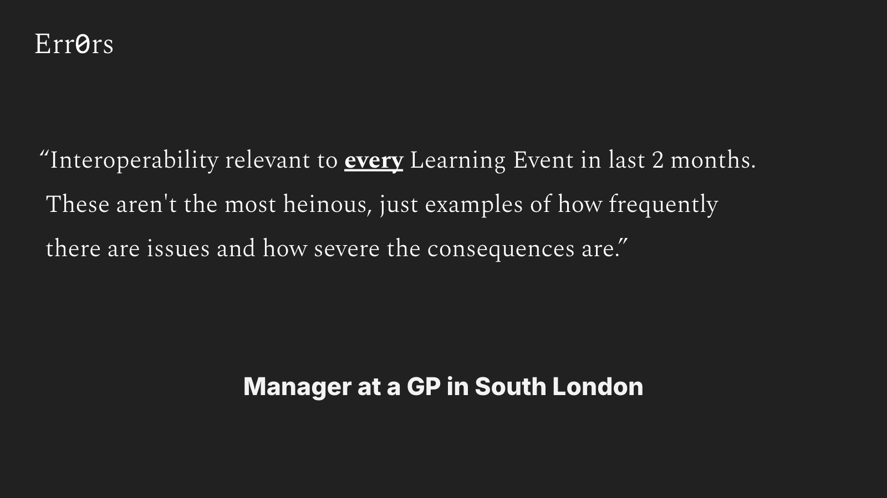

<figcaption>

I reached out to a network of GPs in south london and asked
What problems does the current lack of interop cause?

I got a response that basically said “all of them”

> Interoperability relevant to every Learning Event in last 2 months.
> These aren't the most heinous, just examples of how frequently
> there are issues and how severe the consequences are

They signed off with “if you want to see more, just ask again next month”

</figcaption>
</figure>
<figure>

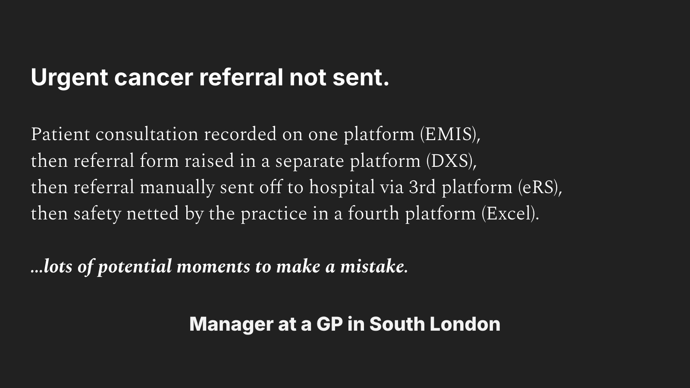

<figcaption>

> **Urgent cancer referral not sent.**
> 
> Patient consultation recorded on one platform (EMIS), then referral form raised in a separate platform (DXS), then referral manually sent off to hospital via 3rd platform (eRS), then safety netted by the practice in a fourth platform (Excel).
> 
> _...lots of potential moments to make a mistake._
> 
> **Manager at a GP in South London**

</figcaption>
</figure>
<figure>

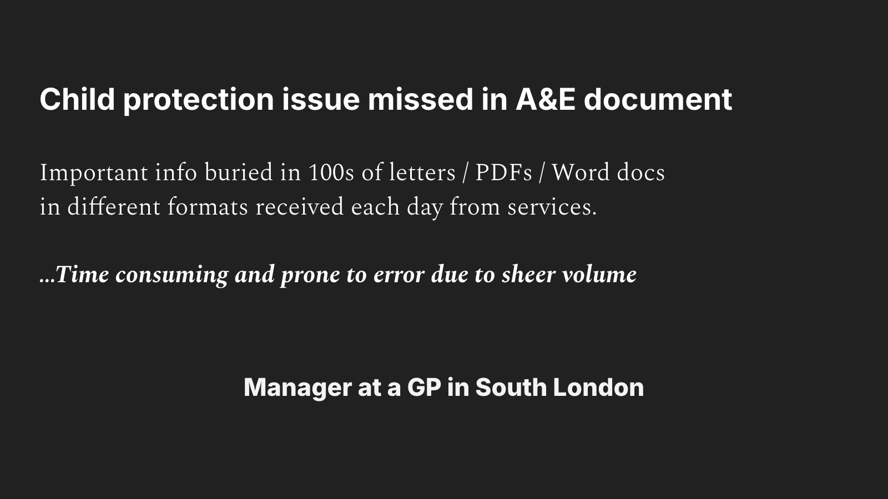

<figcaption>

> **Child protection issue missed in A&E document**
> 
> Important info buried in 100s of letters / PDFs / Word docs in different formats received each day from services.
> 
> _...Time consuming and prone to error due to sheer volume_
> 
> **Manager at a GP in South London**

</figcaption>
</figure>
<figure>

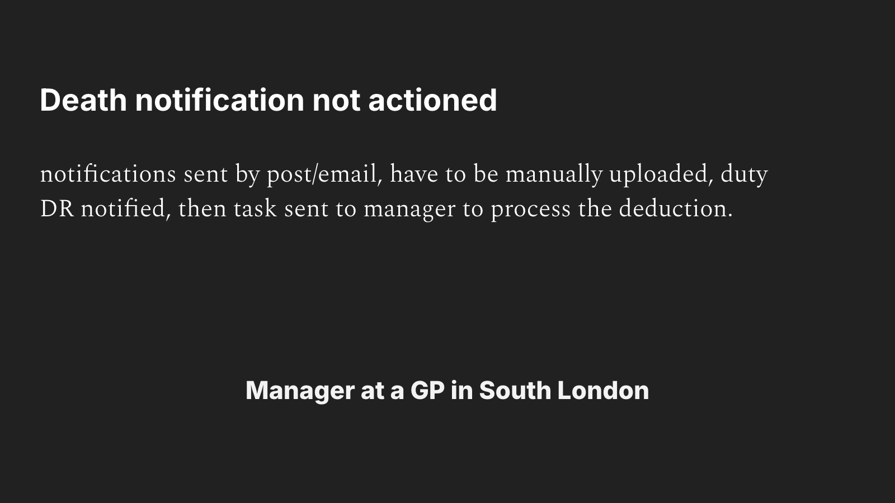

<figcaption>

> **Death notification not actioned**
> 
> Notifications sent by post/email, have to be manually uploaded, duty Dr. notified, then task sent to manager to process the deduction.
> 
> **Manager at a GP in South London**

</figcaption>
</figure>
<figure>

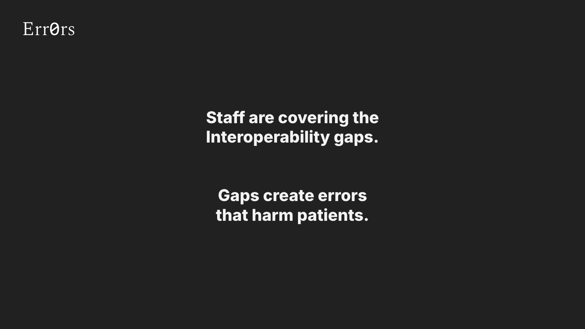

<figcaption>

In summary:
- Staff are manually covering the interoperability gaps - it’s draining, mechanical work.
- And those gaps create room for errors that harm patients.

</figcaption>
</figure>
<figure>

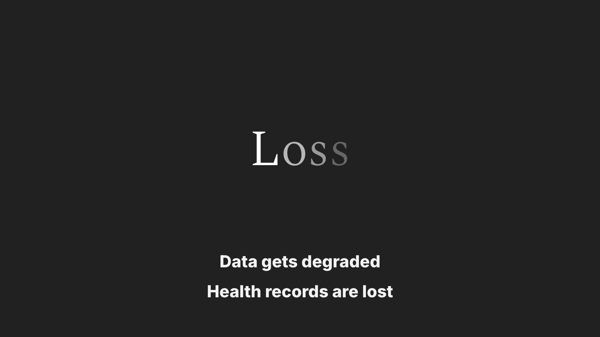

<figcaption>

Next up: Data loss!

I attended the inaugural **Digital Preservation Coalition** meeting focused on Health records. Convened by Marcus Baw, and attended by clinicians and health data archivists across the UK!

The takeaway was that we are storing health records in many different proprietary formats. As we move data from EPR to EPR it gets degraded, as it has to be translated from one custom schema to another.

We have retention policies to keep health records for 30 years, and in places like Barts they increase that to 40 years for cancer records. But if that data is repeatedly degraded along the way it will fail to serve its purpose to inform clinical decisions.

</figcaption>
</figure>
<figure>

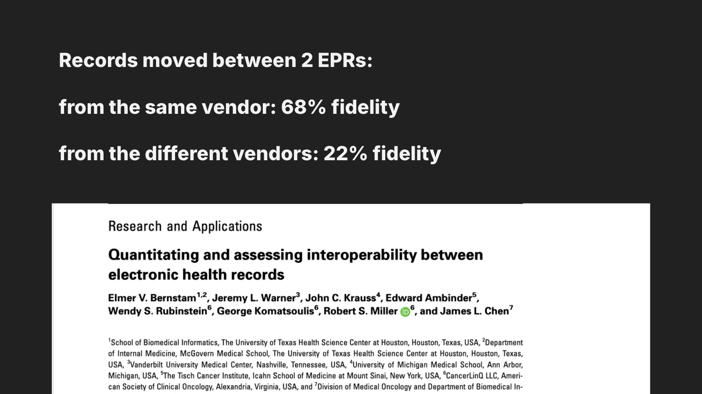

<figcaption>

This paper from 2021 puts a number on it.

When moved between EPRs from the same vendor the mean score was 0.68 for how closely the representation of the info matched the source system.

When moved between EPRs from different vendors the mean score was 0.22.

</figcaption>
</figure>
<figure>

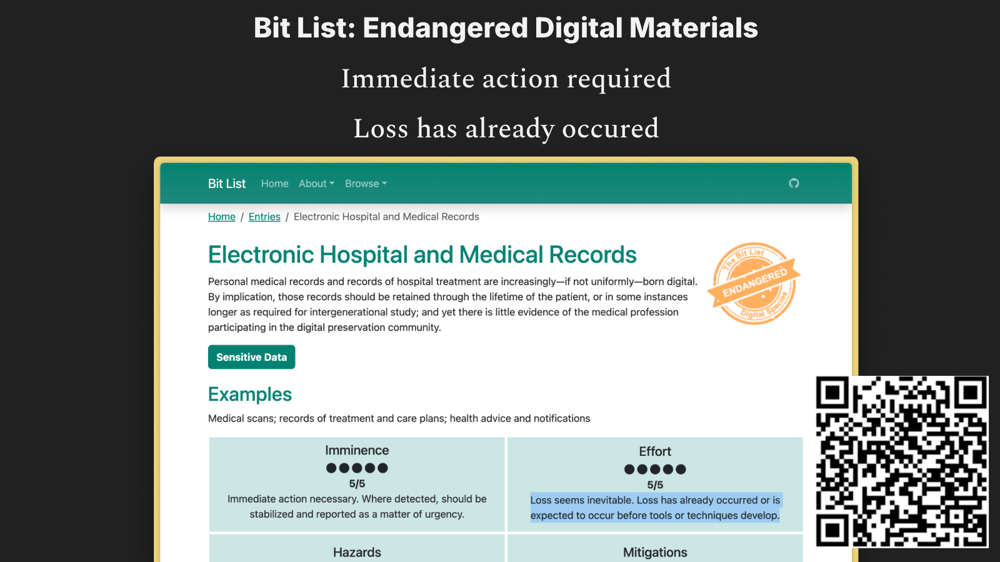

<figcaption>

These problems are reiterated by “the bit list of endangered digital materials”.

It lists medical records as “endangered”, with “immediate action required” and “loss has already occurred”.

</figcaption>
</figure>
<figure>

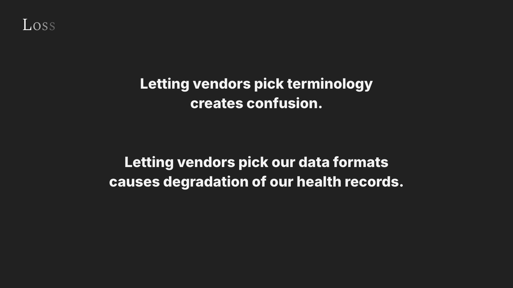

<figcaption>

Letting vendors pick terminology creates confusion.

Letting vendors pick our data formats causes degradation of our health records.

</figcaption>
</figure>
<figure>

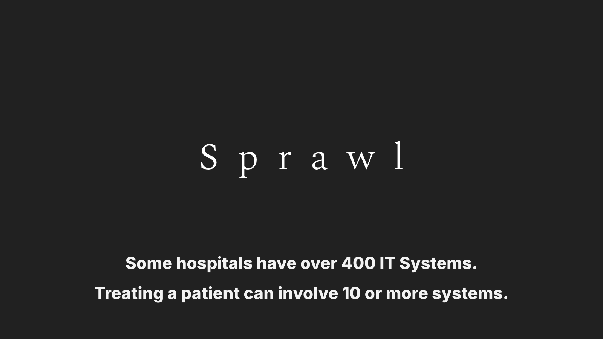

<figcaption>

Digital Sprawl — the NHS has A LOT of IT systems.

Some hospitals have over 400 IT systems. Treating a patient can involve 10 or more systems.

This drains clinicians' time.

</figcaption>
</figure>
<figure>

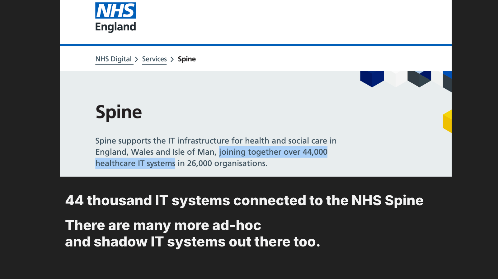

<figcaption>

Not a problem in itself, but just for a sense of scale, there are 44 thousand IT systems connected to the NHS Spine now, from 26 thousand organisations.

There are many more ad-hoc shadow IT systems out there too.

</figcaption>
</figure>
<figure>

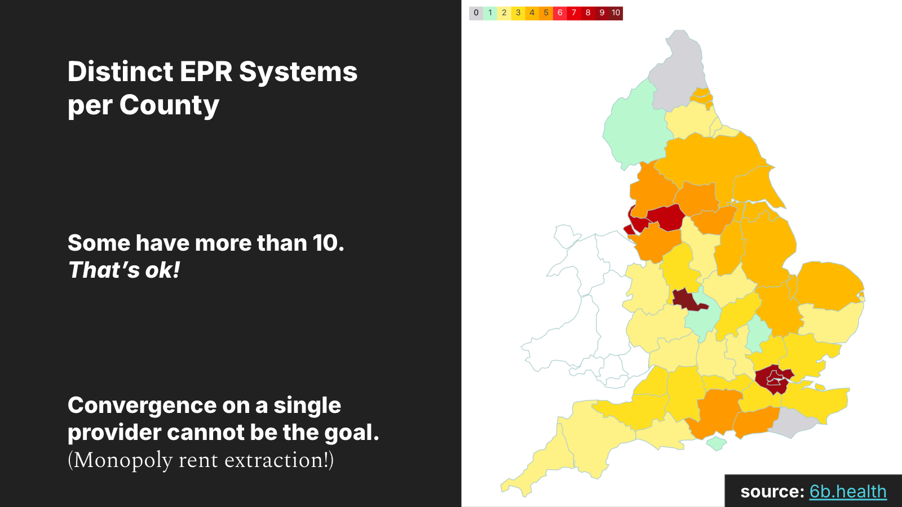

<figcaption>

Using data from [6b.health](https://6b.health), I pieced together data on the EPR in use at every trust. So I built a chart to show the number of distinct EPR systems per county. Some have 10! That’s ok!

This is a somewhat risky chart to share. One way to interpret it is that we should have fewer distinct EPR systems, and that we should standardise on one.

But economists would call that a market failure, a monopoly. Historically, monopolies lead to predictable outcomes: the product gets more expensive while the quality stalls or declines.

</figcaption>
</figure>
<figure>

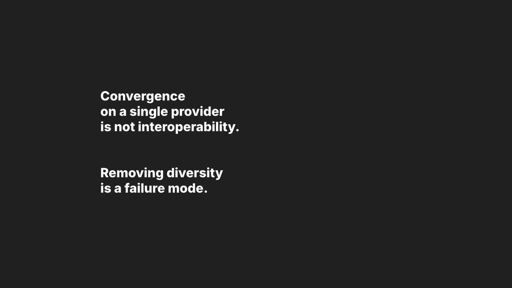

<figcaption>

Diversity in the market is good. You want competition!

What we need are open data formats and protocols so we can easily swap between providers without laborious and “degrading” translation work. Convergence on a single provider is not interoperability!

It’s worth calling this out, as it seems to come up a lot. For example, the GPs in South London have been told by the ICB that they will only get tech support for EMIS. If you use anything else, you are on your own, and you will have additional manual reporting overhead that you have to do!

Consequently, South London GPs all use EMIS except for one maverick who is trialling Medicus!

This isn’t how it should work!

</figcaption>
</figure>
<figure>

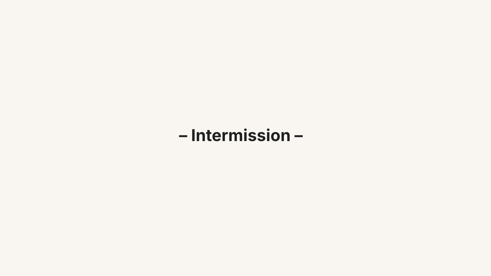

<figcaption>

How we doing? Any questions so far?

</figcaption>
</figure>
<figure>

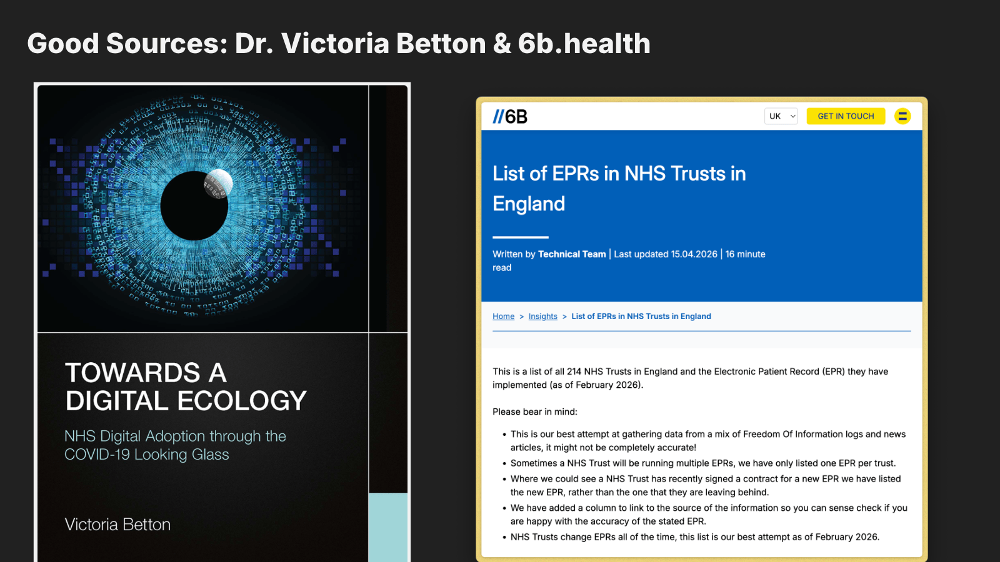

<figcaption>

A quick plug for good sources of information: if you are interested in this stuff too, I highly recommend Dr. Betton’s book “Towards a digital ecology”, which surfaces the many challenges that software projects in the NHS face.

And [6b.health](https://6b.health) — they just keep publishing really useful open data on IT systems the NHS uses today.

</figcaption>
</figure>
<figure>

<figcaption>

Next up, what is blocking progress on interoperability!

I’m going to summarise some themes that came up in interviews.

</figcaption>
</figure>
<figure>

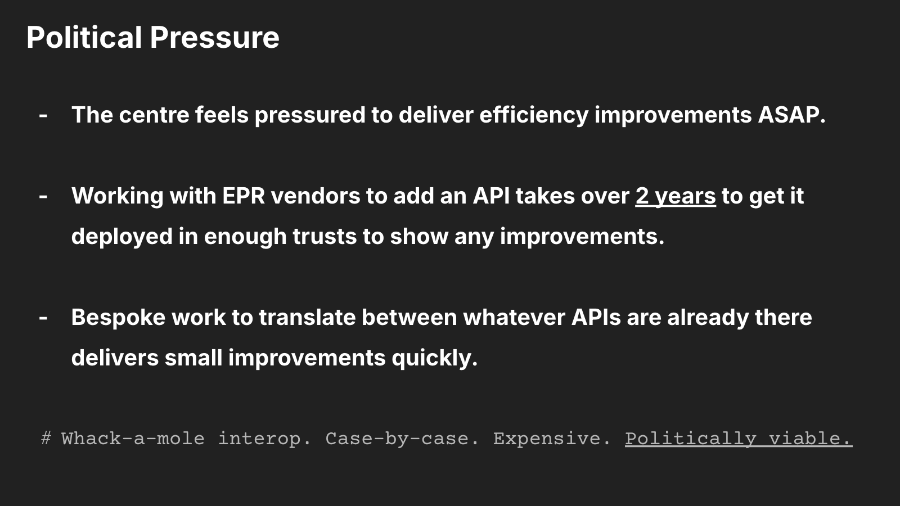

<figcaption>

**Political Pressure**

The centre feels pressured to deliver efficiency improvements ASAP.

Working with EPR vendors to add an API takes over 2 years to get it deployed in enough trusts to show any improvements.

Bespoke work to translate between whatever APIs are already there delivers small improvements quickly.

_Whack-a-mole interop. Case-by-case. Expensive. Politically viable._

</figcaption>
</figure>
<figure>

<figcaption>

Organisational churn!

I’m not gonna narrate the blow-by-blow… but it's a lot. In England there has been a significant org change roughly every 2 years.

Digital interop work at scale requires steady focus over a decade! This reinforces a short-term focus: work that can be completed in less than a year stands a greater chance of getting done.

</figcaption>
</figure>
<figure>

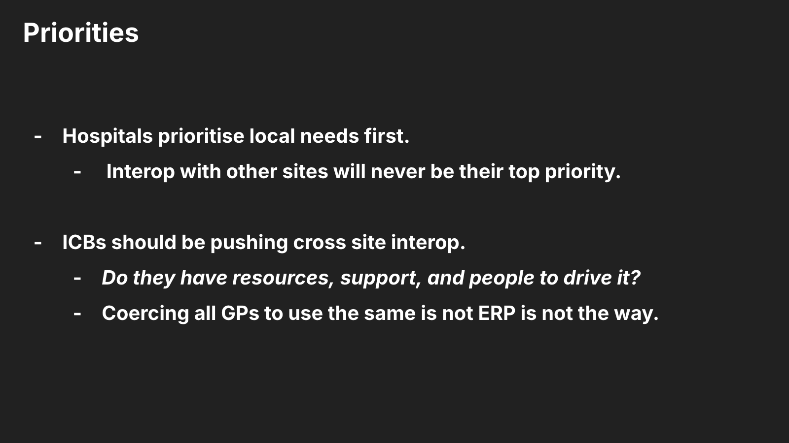

<figcaption>

**Priorities**

Hospitals prioritise local needs first; interop with other sites will never be their top priority.

ICSs should be pushing cross-site interop. Do they have the resources, support, and people to drive it? (I don't know yet, but the implication is no… please tell me if you know more here).

Coercing all GPs to use the same EPR is not the way.

</figcaption>
</figure>
<figure>

<figcaption>

So what work is happening?

I’m going to share some ideas from the digital transformation experts.

</figcaption>
</figure>
<figure>

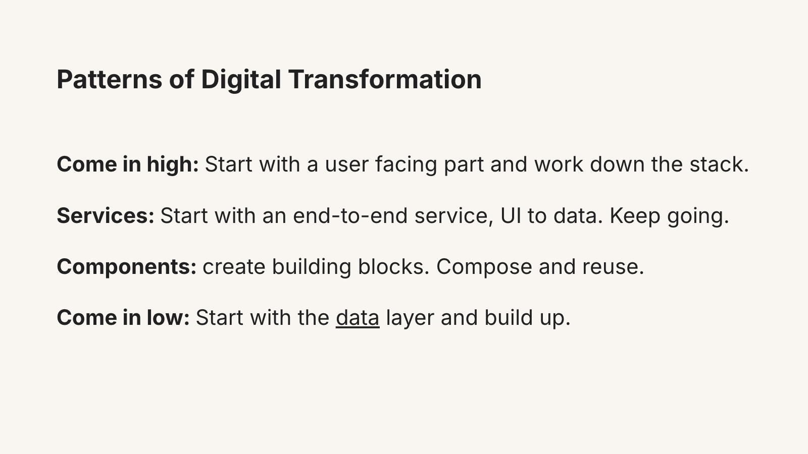

<figcaption>

David Eaves discusses patterns that we see in large-scale digital transformation efforts.

There's “Come in high”: where you start with the user-facing part and work down. Get in between the user and the current mess, show value to the public quickly. GDS started here with gov.uk — they built a common publishing platform for all gov services to present themselves to citizens.

Or start with one end-to-end service, tackling everything from the UI to the data layer for a specific user need.

Or build out fundamental components first, like identity and payment systems, that you then reuse to build user-facing services. India’s national DPI stack started here with the Aadhaar digital ID scheme.

Or you can “Come in low”: start with the data layer and build up. Estonia’s X-Road is an example of this. They focused on getting existing data out of the silos.

</figcaption>
</figure>
<figure>

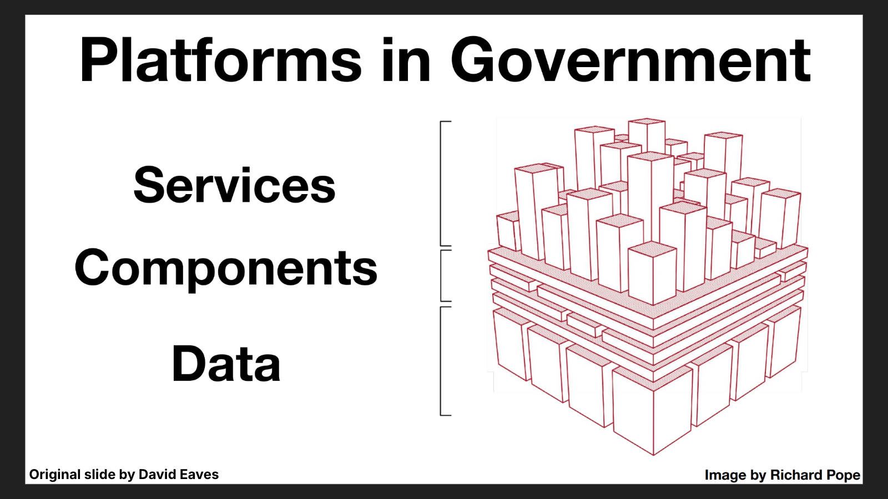

<figcaption>

To visualise this, I’m gonna reuse open-source components:
- A slide from the digital public infrastructure expert David Eaves!
- With an openly licensed image created by digital government expert Richard Pope!

But let’s update it for the NHS!

</figcaption>
</figure>
<figure>

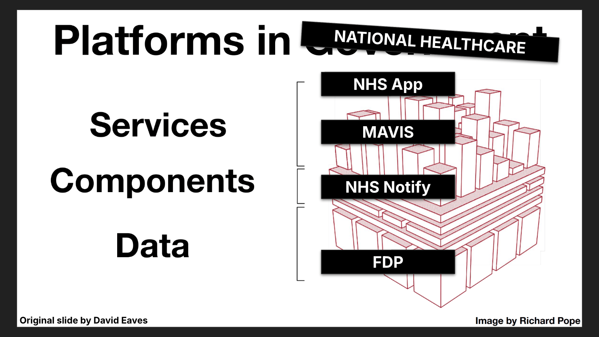

<figcaption>

Taa-daa!

Here, the NHS App is a service that represents the “come in high” strategy. It hides the current complexity from the users behind a uniform user interface you control, while we work on upgrading the old plumbing that feeds it. It creates a focal point for interoperability work — all new services should share data with the patient via the NHS App.

MAVIS tackles a whole service end-to-end to ensure it works seamlessly for the users and the data gets to where it needs to be. Build enough of these and you have a digital platform!

NHS Notify is a shared component that lifts a burden from all other services that adopt it, creating a more consistent experience for users.

The FDP represents the “Come in low” strategy: organise the data, and then build up from there. My assertion is we need a more radically interoperable strategy for the data layer, so let’s look at how the FDP works.

</figcaption>
</figure>
<figure>

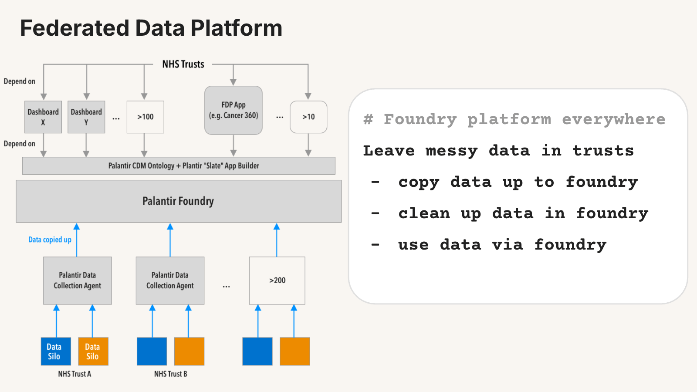

<figcaption>

I can talk about this a lot, but I’d summarise the strategy as “use the Palantir Foundry platform everywhere”.

As a plan, it acknowledges that changing things at every trust may take too long. So to speed things up, it leaves the data in trusts as it is:
- It copies it up to the Foundry platform
- Cleans it up in the Foundry platform
- And provides access to it via the Foundry platform

</figcaption>
</figure>
<figure>

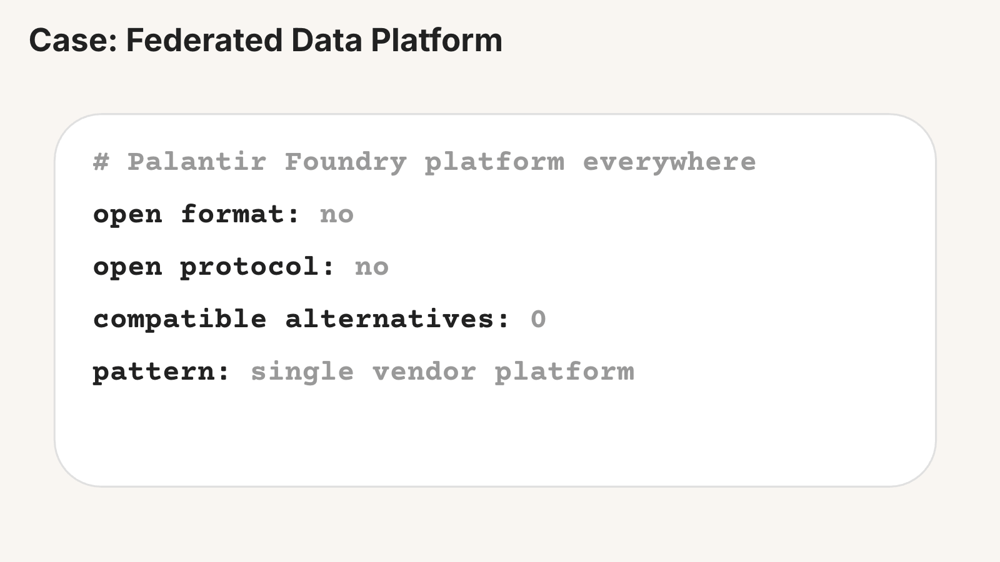

<figcaption>

But it’s not an interoperable solution:
- It's not using open formats
- The governance of the Canonical Data Model isn’t open
- It’s not using an open protocol to move the data
- We are using a proprietary data collection agent to copy data up to Foundry
- We can’t reuse that tool to send data elsewhere, like the new Health Data Research Service project
- We can only access the data via Foundry

So we are back in that single-vendor mode, that looks like interop but isn’t.

</figcaption>
</figure>
<figure>

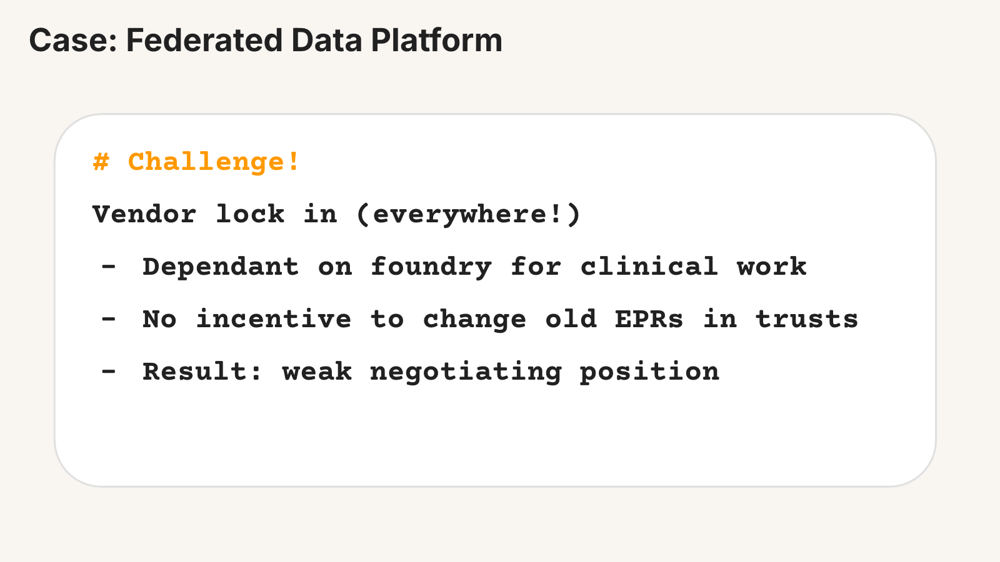

<figcaption>

The obvious challenge is what to do about the vendor lock-in.

As the amount of data in it grows, and hospitals update workflows to depend on Foundry for operational and clinical work:
- We lack a credible exit
- And end up in a weak negotiating position when the contract comes up for renewal

It also cements in the old EPRs in the trusts as well:
- Once we have written the custom transforms for it, there is an incentive to keep the old one in place, otherwise we have to redo that work.

</figcaption>
</figure>
<figure>

<figcaption>

**What is happening elsewhere?**

</figcaption>
</figure>
<figure>

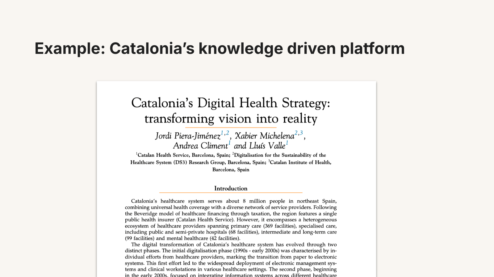

<figcaption>

The Catalonian national health service is also taking this “come in low” approach.

</figcaption>
</figure>
<figure>

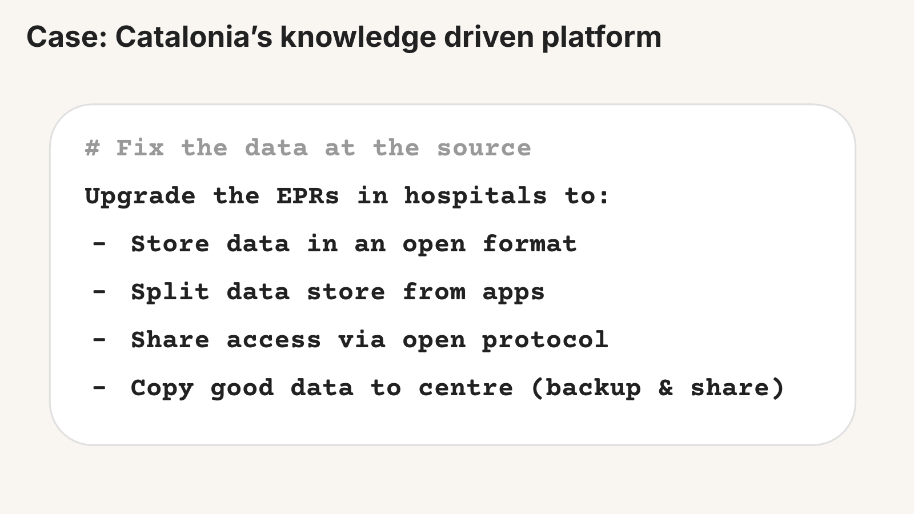

<figcaption>

They call it “driving semantic coherence”. I’d summarise it as “fix the data at the source”.

They are 2 years into a 6-year plan to:
- Upgrade the EPRs in every hospital
- Store the data in an open format
- Split the data store from the EPR app services (letting them change EPRs and A/B test them without harming the data)
- Share access with other systems via open protocols

They also copy that data up to a central regional repository for resilience and to replicate it to other hospitals as needed. It’s moving the exact same data around in the same open data format to all locations, which avoids the degradation issue when moving between different EPR data models.

</figcaption>
</figure>
<figure>

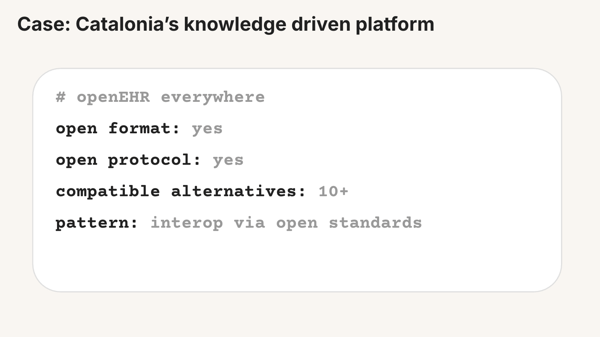

<figcaption>

So they are moving to:
- An open format
- An open protocol
- An ecosystem of vendors

Some of those vendors include:
- Better (Slovenia)
- Vitagroup and EHRbase (Germany)
- DIPS (Norway)
- And more…

</figcaption>
</figure>
<figure>

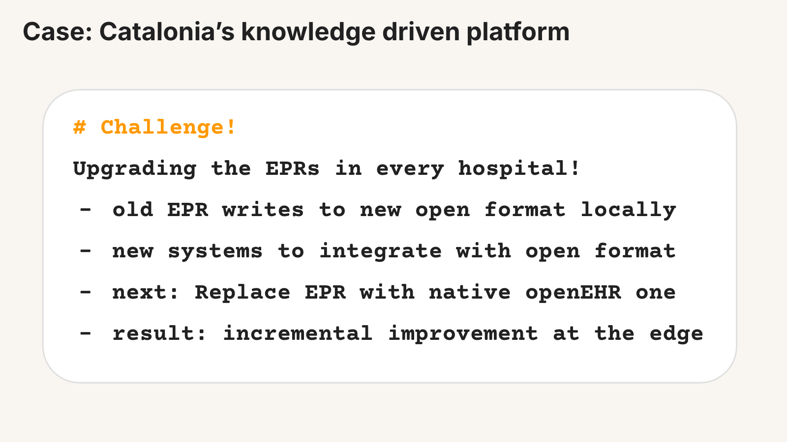

<figcaption>

**Challenge! Upgrading the EPRs in every hospital!**

The plan is to start by getting:
- The old EPRs to write to the new open format locally
- Any new systems to integrate with the open format rather than the old EPR
- When the contract expires: replace the EPR with one that uses the open format natively

The result they are aiming for is incremental improvement at the edge, or “semantic coherence”.

</figcaption>
</figure>
<figure>

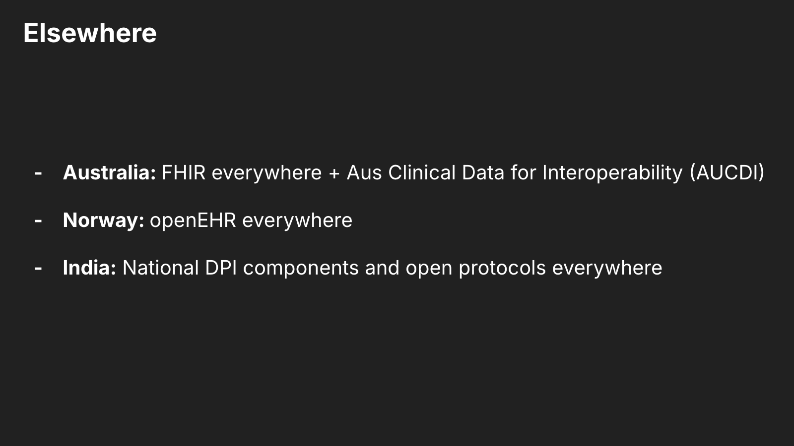

<figcaption>

What’s going on elsewhere? I need to dig deeper on these, but at a high level:

- **Australia:** is moving to FHIR as its open protocol, and the Australian Clinical Data for Interoperability team are deciding the open formats to use.
- **Norway:** is openEHR everywhere for the format and protocol.
- **India:** is an interesting case. Its healthcare data solution is still TBD, but in general they are focused on building out national DPI components and open protocols everywhere, deciding the rules of the game at the national level but getting private companies to build implementations of those protocols.

</figcaption>
</figure>
<figure>

<figcaption>

So, what should we do?

</figcaption>
</figure>
<figure>

<figcaption>

Keep calm and open source, open format, and open protocol!

The DPSP should keep on building high-quality end-to-end services that solve a problem well. If you keep adding more services, you will end up with a digital “platform”, and the shared components like Notify make it easier to build more.

</figcaption>
</figure>
<figure>

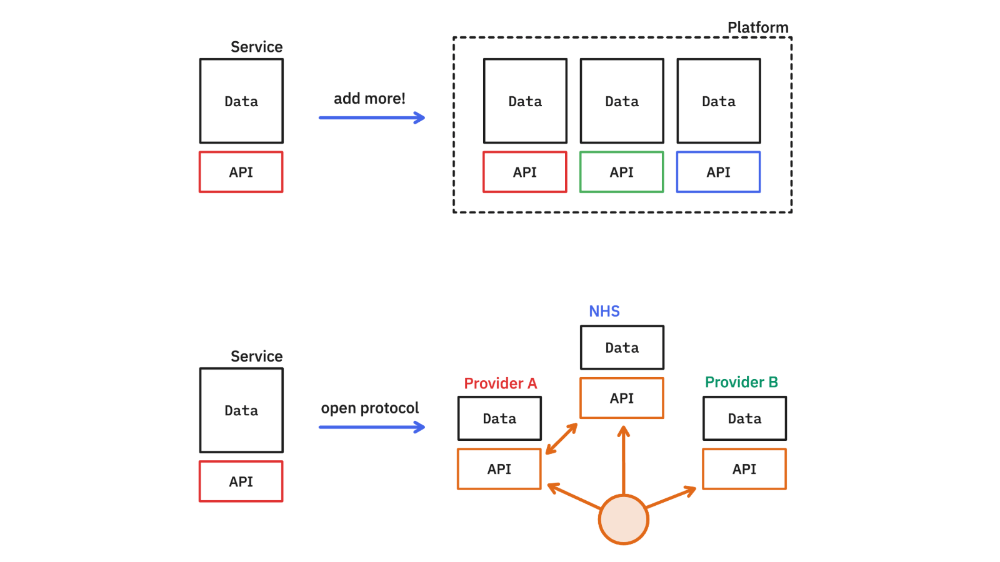

<figcaption>

Better still if you find the open protocols we need that allow public and private teams to collaborate on building pieces of the puzzle that work together. Choose plug sockets and the data formats that let us plug in different solutions and A/B test them, in-situ, rather than locking us into their service, or capturing all the data.

Notably, AWS kept on adding services. It now has hundreds and it is definitely a “platform” — millions of developers now build solutions on top of it. A nationally owned digital platform could allow public and private delivery of interoperable solutions, but that puts a lot of work on the NHS to build all the services.

AWS also accidentally built a de-facto protocol with its S3 API. Now there are dozens of services and hundreds of tools that implement that API. It started as an API for a single service, as part of a platform, but has become a protocol that many systems understand.

For healthcare, we’ll need well-governed, open protocols that are multiplayer… and don’t assume that the FDP or Epic etc. will always be the thing that holds the data.

</figcaption>
</figure>
<figure>

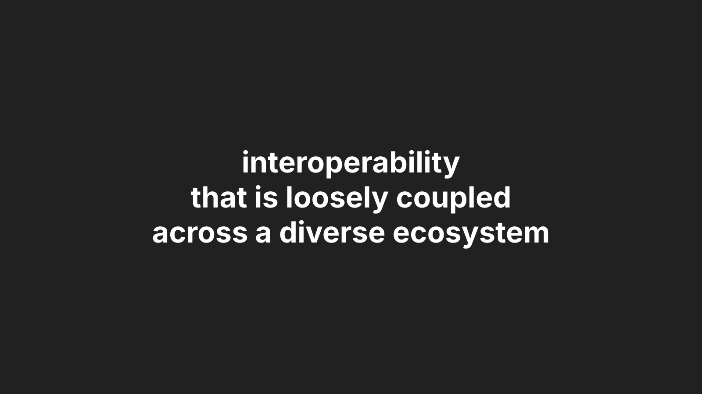

<figcaption>

We need solutions that lead to a form of digital interoperability that is loosely coupled across a diverse ecosystem, not a single-vendor monoculture.

</figcaption>
</figure>
<figure>

<figcaption>

For me: I’m about to start digging into what is needed to coax the duopoly of EHR providers for GPs in the UK to use open data formats, and what would help open solutions compete in that market.

If you have any info on that, please share.

If you’ve spotted errors or have suggestions, please get in touch: [oli@zilla.org.uk](mailto:oli@zilla.org.uk)

TAA DAA.

</figcaption>
</figure>

---

_Original Deck: [docs.google.com/presentation/d/1p-vwbdQgK_wU4Lzj75cWnt5rxd60FQexiFR76XqP5Mg](https://docs.google.com/presentation/d/1p-vwbdQgK_wU4Lzj75cWnt5rxd60FQexiFR76XqP5Mg/edit)_

_Published: 2026-05-28_
